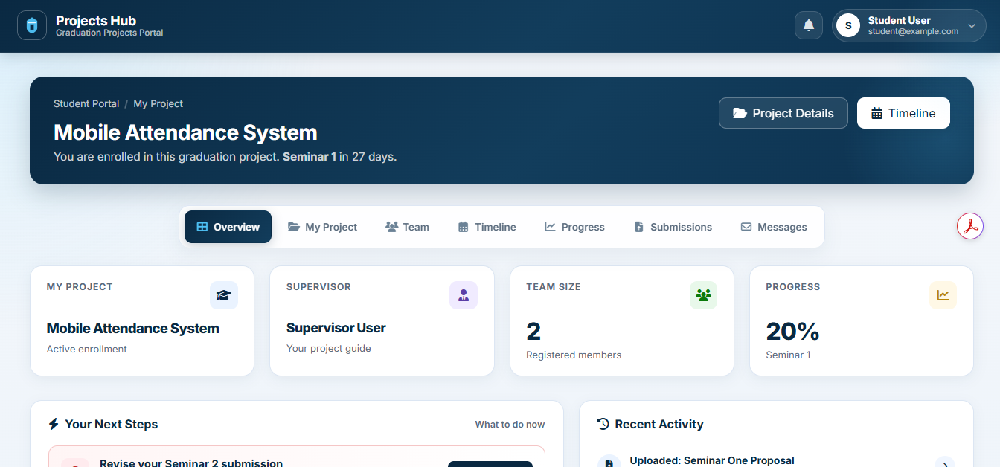
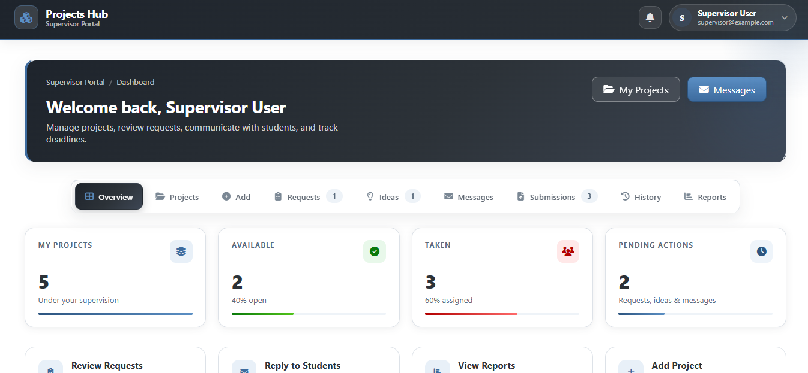
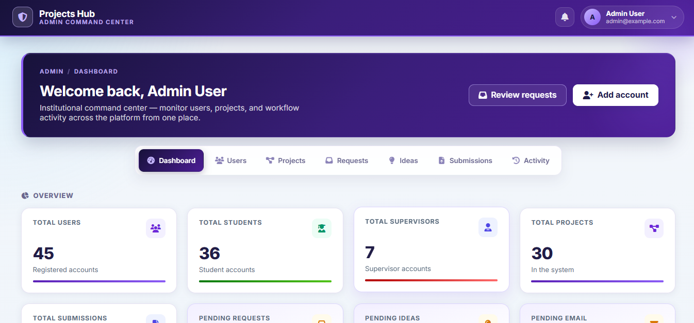
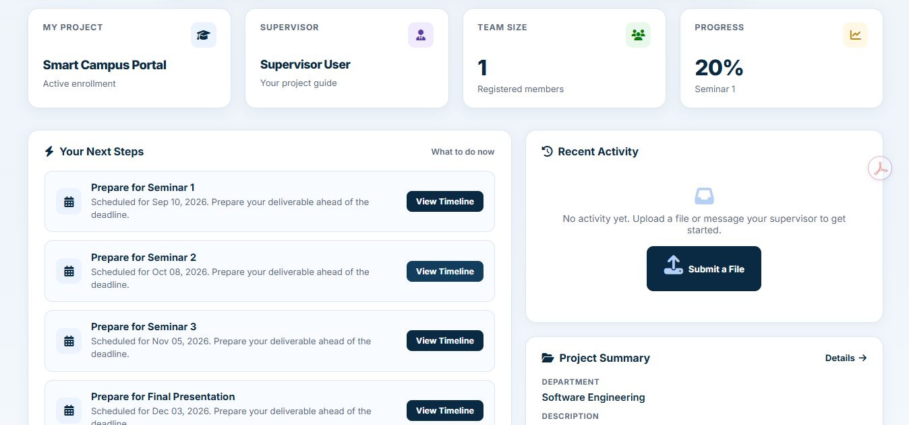

# 🎓 Graduation Project Management Platform

A web-based platform designed to manage and streamline the graduation project lifecycle between students, supervisors, and administrators.

## 📸 Screenshots

Student Dashboard

Supervisor Dashboard

Admin Dashboard

Workflow Overview

## ✨ Overview

The Graduation Project Management Platform is a centralized web application developed to simplify the management of graduation projects within an academic environment.
The platform connects three main user roles:
Students
Supervisors
Administrators
It provides a structured workflow for managing project ideas, applications, supervision, submissions, reviews, and administrative operations.

## 🎯 Key Features

### 🔐 Authentication & Authorization

University-number based login
Role-based access control
Separate workflows for students, supervisors, and administrators

### 🎓 Student Features

Submit project ideas
Apply to projects
Manage project participation
Submit project-related materials
Track project status

### 👨‍🏫 Supervisor Features

Review project ideas
Manage supervised projects
Handle student requests
Review submissions
Monitor project progress

### 🛠️ Administration

Manage users
Manage roles
Manage supervisors
Monitor system activity
Handle administrative workflows

## 🤖 AI Proposal Assistant

The platform includes an AI-assisted proposal analysis feature designed to help supervisors evaluate the similarity between submitted project ideas.

### How It Works

1. A project idea is submitted.
2. The idea description is converted into a text embedding.
3. The embedding is compared with existing project ideas.
4. Cosine similarity is calculated.
5. Similar ideas are presented to the supervisor for review.

### AI Technologies

-Ollama
-nomic-embed-text
-Text embeddings
-Cosine similarity

## 👥 User Roles

Role Main Responsibilities
Student Submit ideas, apply to projects, manage participation and submissions
Supervisor Review ideas, manage projects, handle student requests
Administrator Manage users, roles, supervisors, and system operations

## 🛠️ Tech Stack

Category Technology
Backend Laravel
Programming Language PHP
Frontend Blade, HTML, CSS, JavaScript
Database SQLite
ORM Eloquent
Authorization Laratrust
AI Ollama
Embeddings nomic-embed-text
Testing Pest
Version Control Git & GitHub

## 🏗️ Architecture

The application follows the Laravel MVC architecture and uses Eloquent ORM for database interaction.
The AI Proposal Assistant communicates with a local Ollama instance for embedding generation and proposal similarity analysis.

## 🧪 Testing

Automated tests were implemented using Pest to verify important application workflows and business rules.
The test suite includes coverage for areas such as:
Authentication
Role-based access
Student workflows
Supervisor workflows
Project management workflows
AI proposal similarity

### Running Tests

'''bash
php artisan test
'''markdown

## 👨‍💻 Author

**Nader Alrifai**
Software Engineering Graduate
[LinkedIn](https://www.linkedin.com/in/nader-alrifai-52801b270)
