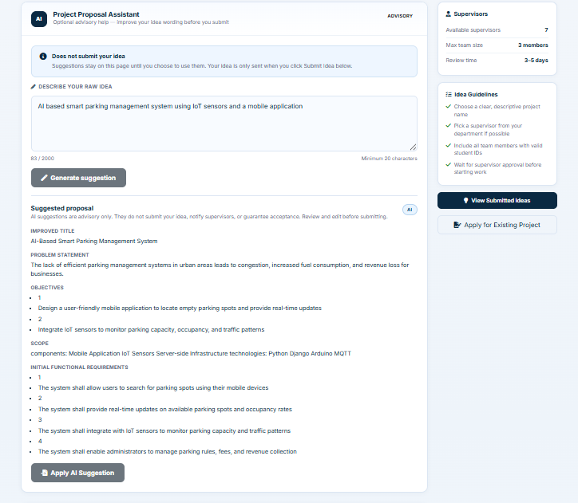
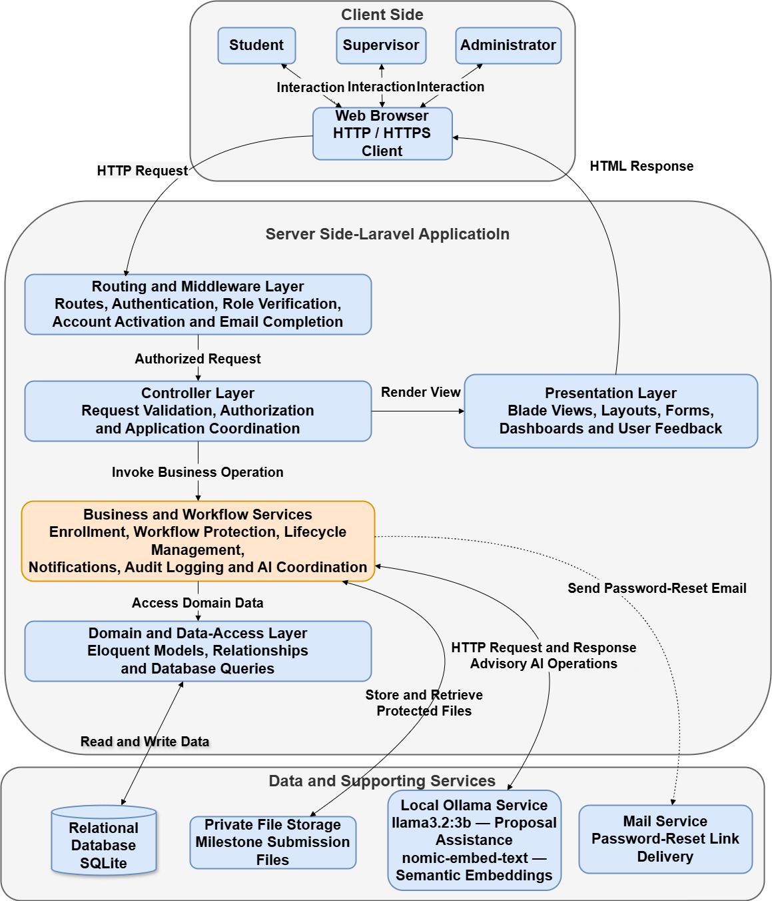

# 🎓 Graduation Project Management Platform

A web-based platform designed to manage and streamline the graduation project lifecycle between students, supervisors, and administrators.


## 📸 Screenshots

**Student Dashboard**


**Supervisor Dashboard**


**Admin Dashboard**


**Project Workflow**


## ✨ Overview

The Graduation Project Management Platform is a centralized web application developed to simplify the management of graduation projects within an academic environment. It connects three main user roles: students, supervisors, and administrators. The platform provides a structured workflow for managing project ideas, applications, supervision, submissions, reviews, and administrative operations.

## 🎯 Key Features

### 🔐 Authentication & Authorization

- University number-based login
- Role-based access control
- Separate workflows for students, supervisors, and administrators

### 🎓 Student Features

- Submit project ideas
- Apply to projects
- Manage project participation
- Submit project-related materials
- Track project status

### 👨‍🏫 Supervisor Features

- Review project ideas
- Manage supervised projects
- Handle student requests
- Review submissions
- Monitor project progress

### 🛠️ Administration

- Manage users
- Manage roles
- Manage supervisors
- Monitor system activity
- Handle administrative workflows

## 🤖 AI Proposal Assistant

The platform includes an AI-assisted proposal analysis feature designed to help supervisors evaluate the similarity between submitted project ideas.

### How It Works

1. A project idea is submitted.
2. The idea description is converted into a text embedding.
3. The embedding is compared with existing project ideas.
4. Cosine similarity is calculated.
5. Similar ideas are presented to the supervisor for review.

### AI Technologies

- Ollama
- `nomic-embed-text`
- Text embeddings
- Cosine similarity



## 👥 User Roles

| Role          | Main Responsibilities                                                 |
| ------------- | --------------------------------------------------------------------- |
| Student       | Submit ideas, apply to projects, manage participation and submissions |
| Supervisor    | Review ideas, manage projects, handle student requests                |
| Administrator | Manage users, roles, supervisors, and system operations               |

## 🛠️ Tech Stack

| Category             | Technology                             |
| -------------------- | -------------------------------------- |
| Backend              | Laravel 13                             |
| Programming language | PHP 8.3+                              |
| Frontend             | Blade, HTML, CSS, JavaScript, Vite    |
| Database             | SQLite (default local setup)           |
| ORM                  | Eloquent                               |
| Authorization        | Laratrust                              |
| AI                   | Ollama                                 |
| Embeddings           | `nomic-embed-text`                     |
| Testing              | Pest                                   |
| Version control      | Git and GitHub                         |

## 🏗️ Architecture

The system combines three complementary architectural patterns:

- MVC (Model–View–Controller): Separates the application into models, views, and controllers so data, presentation, and request handling remain organized.
- Client–Server Architecture: Keeps the interface on the client side while server-side components manage business logic, authentication, and data services.
- Layered Architecture: Divides the system into distinct layers to improve maintainability, scalability, and separation of concerns.


## 🚀 Getting Started

### Prerequisites

- PHP 8.3 or newer
- Composer
- Node.js and npm
- SQLite support enabled for local development
- Ollama installed locally for AI similarity and proposal assistance

### Local Setup

```bash
composer install
npm install
cp .env.example .env
php artisan key:generate
php artisan migrate --seed
php artisan serve
npm run dev
```

If AI features are enabled, make sure Ollama is running and that the embedding model is available:

```bash
ollama pull nomic-embed-text
```

## 🧪 Testing

Automated tests are implemented using Pest to verify the core workflows and business rules of the application, including:

- Authentication
- Role-based access control
- Student workflows
- Supervisor workflows
- Project lifecycle management
- AI proposal similarity checks

### Running Tests

```bash
php artisan test
```

## 👨‍💻 Author

**Nader Alrifai**

Software Engineering Graduate
[LinkedIn](https://www.linkedin.com/in/nader-alrifai-52801b270)
